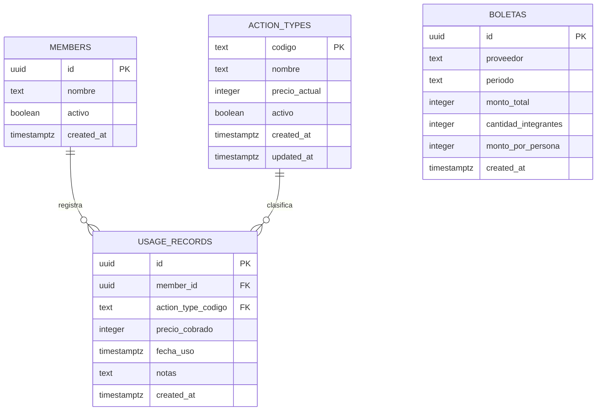

# Modelo de Datos — Overview (v1)

Ver decisión de alcance en [[2026-08-28-modelo-datos-v1-alcance]]. DDL ejecutable en `supabase/migrations/0001_init_schema.sql`.

## Diagrama relacional

`BOLETAS` es una tabla independiente, sin FK hacia las demás: el reparto es en partes iguales (una cifra por integrante, congelada al momento de la carga), no un evento por persona. Ver [[boletas]] y [[2026-08-31-boletas-manuales]].

## Relaciones

- Un `member` puede tener muchos `usage_records` (1 → N).
- Un `action_type` puede tener muchos `usage_records` (1 → N).
- `usage_records` es la tabla transaccional: cada fila es un evento de "alguien hizo un lavado/secado".

## Principio de diseño clave: precio congelado

`usage_records.precio_cobrado` es un **snapshot** del precio vigente en `action_types.precio_actual` al momento de registrar el uso. Esto es intencional: si el precio del lavado sube mañana, los usos ya registrados deben seguir reflejando lo que realmente costaron en su momento. Ver [[usage_records]] para el detalle.

## Notas

- No hay tabla de "hogares" en v1 — todo el modelo asume un único hogar. Ver [[99-Futuro-fuera-de-alcance]].
- No hay tabla de pagos/settlements en v1 — calcular "cuánto debe cada uno" es una consulta agregada sobre `usage_records` (ver [[US-03-resumen-por-persona]]), no un estado persistido todavía.
